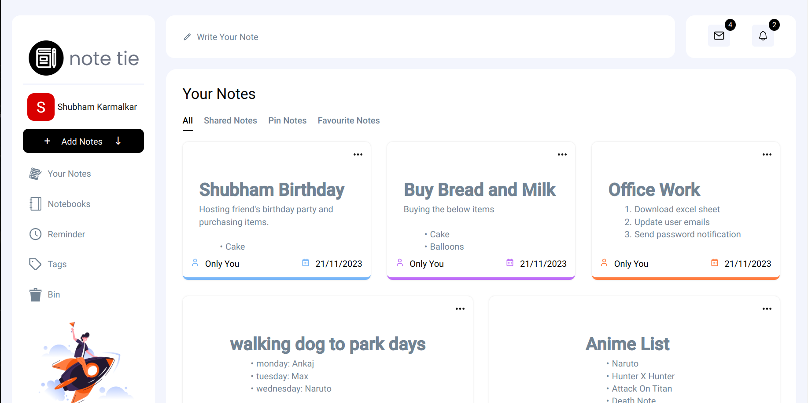

# React-Firebase Notes App 

Its a React app having firebase as a backend and contains functionality like letting user create, update, delete, share notes created.

## Tech Stack

**Client:** React, TypeScript, HTML, CSS

**BackEnd:** Firebase

## Screenshots

## Demo

site Url : https://note-tie.web.app/
